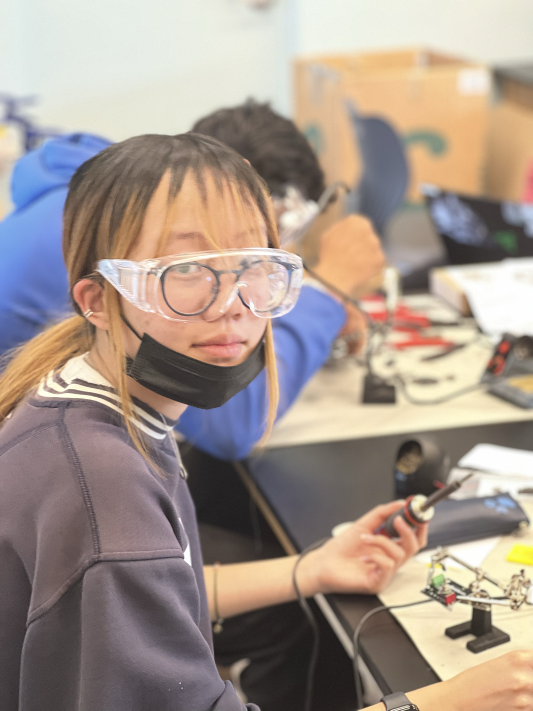

# Solar Tracker
<!-- Replace this text with a brief description (2-3 sentences) of your project. This description should draw the reader in and make them interested in what you've built. You can include what the biggest challenges, takeaways, and triumphs from completing the project were. As you complete your portfolio, remember your audience is less familiar than you are with all that your project entails! -->

| **Engineer** | **School** | **Area of Interest** | **Grade** |
|:--:|:--:|:--:|:--:|
| Isabella H | Homestead | Electrical Engineering | Incoming Junior

<!--**Replace the BlueStamp logo below with an image of yourself and your completed project. Follow the guide [here](https://tomcam.github.io/least-github-pages/adding-images-github-pages-site.html) if you need help.** -->

<!--  -->

  
<!-- # Final Milestone -->
<!-- For your final milestone, explain the outcome of your project. Key details to include are:
- What you've accomplished since your previous milestone
- What your biggest challenges and triumphs were at BSE
- A summary of key topics you learned about
- What you hope to learn in the future after everything you've learned at BSE

**Don't forget to replace the text below with the embedding for your milestone video. Go to Youtube, click Share -> Embed, and copy and paste the code to replace what's below.**

<iframe width="560" height="315" src="https://www.youtube.com/embed/F7M7imOVGug" title="YouTube video player" frameborder="0" allow="accelerometer; autoplay; clipboard-write; encrypted-media; gyroscope; picture-in-picture; web-share" allowfullscreen></iframe> -->

# Second Milestone
<!-- For your second milestone, explain what you've worked on since your previous milestone. You can highlight:
- Technical details of what you've accomplished and how they contribute to the final goal
- What has been surprising about the project so far
- Previous challenges you faced that you overcame
- What needs to be completed before your final milestone -->


For my second milestone, I was able to figure out the servo movement to have it track the light, as well as implement the smart phone charging module into my solar tracker. The mount of the solar tracker is not very stable, and due to the structure's geometry, there are a lot of vibrations as the servos move. The solar panel is set to track the light. So using some geometry, it is designed to move toward where there is the most light using the four ambient light sensors. Because of the equations used when calculating the angle of the servos, the solar panel is very unlikely to reach exactly where the light is hitting it. This is because there will always be light registered in the sensors, as it is almost impossible to only have light onto one sensor, or have the light values equal to each other. I plan to work more on the math behind the angles of the servos, and hopefully have more accurate movement before my next milestone. Because the lithium power module was broken in my previous milestone, I couldn’t include my smart phone charging port, but I was able to finish it for this milestone. The power module is connected to the solar panel and a set of batteries which is then connected to the charging port. The solar energy is converted into electric energy via solar panels through the input port. The output port is then interfaced with the rechargeable batteries and the electric energy is saved into the batteries. Before my third milestone, I plan on designing a new servo mount using CAD to combat the shaking of the solar panel, as well as add a few modifiers like having a voltage sensor or having a smartphone to be able to control the project.

## Progress:
- finished coding portion of project
- have yet to build new servo mount

## Challenges:
- figuring out angle of servos based on light sensor values
- trying to fix servo movement

<!-- **Don't forget to replace the text below with the embedding for your milestone video. Go to Youtube, click Share -> Embed, and copy and paste the code to replace what's below.**

<iframe width="560" height="315" src="https://www.youtube.com/embed/y3VAmNlER5Y" title="YouTube video player" frameborder="0" allow="accelerometer; autoplay; clipboard-write; encrypted-media; gyroscope; picture-in-picture; web-share" allowfullscreen></iframe> -->

# First Milestone
My project is a solar tracker, which tracks where there is the most light, as well as tracking the temperature and humidity of the air. In the first milestone, I finished building the entire project, as well as the coding portion of 9 projects (kit comes with 11 total projects). Each individual part works and have been tested, and are mostly combined in the last project. I have yet to figure out the code for determining where the solar panel turns based off the light that is projected onto the tracker. A problem I was currently facing was with the connection of a pair of the wires, because I plugged one of them into the wrong socket, which resulted in a short circuit and damaged the sensor I was working with. The solar panel does not move very smoothly, and I plan to figure out what is causing that, as well as implement the actual movement for the panel before my next milestone. For what’s next, I plan to continue working on the coding for this project and put back the lithium power module, as well as understand more about the different processes and how different parts work. 

<!-- ## Summary:
- Solar Tracker, measures solar energy, temperature, and humidity
- completed build process, as well as most of Arduino coding portion (9 of 11 proj)
- struggled with connecting pair of wires, code for movement of servos -->

## Components: 
- photoresister sensor: changes its resistance when light shines on it
- humidity and temperature sensor: detects and measures dampness and air temperature
- passive buzzer: plays variety of tones that could be modified
- digital intensity module: digital light intensity sensor integrated circuit used for two-wire serial bus interface
- solar panel, push button module, display module, control board, led module

## Progress:
- finished building portion of project
- finished coding 9 of 11 projects
- have yet to figure out exact Servo movement

## Challenges: 
- connecting wires, difficult to naviage which jumper goes to which port
- figuring out movement of Servo

<!-- **Don't forget to replace the text below with the embedding for your milestone video. Go to Youtube, click Share -> Embed, and copy and paste the code to replace what's below.** -->

<iframe width="560" height="315" src="https://www.youtube.com/embed/uOYtJBz5YxU" title="YouTube video player" frameborder="0" allow="accelerometer; autoplay; clipboard-write; encrypted-media; gyroscope; picture-in-picture; web-share" allowfullscreen></iframe>

# Starter Project
My starter project was the Useless Box, which is a box that turns itself off when you switch it on. It has a set of switches, a circuit board (PCB), a small motor, a LED, an arm, and the box itself. When the switch is turned on, the lid of the box will open due to the arm raising, and the arm will turn off the switch. This project consists of the process of soldering components like resistors, switches, and an LED to the circuit board, and screwing in screws to connect the motor and board to the main box. When you turn the switch, the motor gains power due to the completion of the circuit so it starts rotating, which turns on the LED and moves the arm inside the box to turn the switch off which cuts the circuit and thus makes the motor stop running. There were a few parts in my kit that arrived a bit off center, which caused me to struggle towards the end with putting together the box because I had to sand down a few pieces and the acrylic panels ended up snapping due to how brittle it was, but after switching out the pieces I was able to get the project running.

## Summary:
- Usless Box, turns itself off when you turn switch on
- when switch on, motor turns on which causes arm to turn and turns off switch
- struggled with soldering at first, acrylic panels were off center and brittle

## Components:
- set of switches
- PCB board
- motor
- LED: turns on and shines red when box is opened / switch is turned on

## Challenges:
- putting together box, sanding down pieces and replacing them
- soldering on circuit board (PCB), did not heat up wires enough

<iframe width="560" height="315" src="https://www.youtube.com/embed/ec8RczE3qd8" title="YouTube video player" frameborder="0" allow="accelerometer; autoplay; clipboard-write; encrypted-media; gyroscope; picture-in-picture; web-share" allowfullscreen></iframe>

# Schematics 
<!-- Here's where you'll put images of your schematics. [Tinkercad](https://www.tinkercad.com/blog/official-guide-to-tinkercad-circuits) and [Fritzing](https://fritzing.org/learning/) are both great resoruces to create professional schematic diagrams, though BSE recommends Tinkercad becuase it can be done easily and for free in the browser. -->

# Code
<!-- Here's where you'll put your code. The syntax below places it into a block of code. Follow the guide [here]([url](https://www.markdownguide.org/extended-syntax/)) to learn how to customize it to your project needs. 
-->
```c++
/*
  Solar Tracker - tracks light, temperature, humidity onto LCD Display module, as well
    as moves the solar panel based on where there is most light. Uses button to reset 
    the solar panel into its initial position. Can charge powered devices with smart
    phone charging module.
  @author Isabella Hu
  
  version 6/23
*/

#include <Servo.h>  
#include "ServoEasing.hpp"
#include <Wire.h>
#include <BH1750.h>
#include <LiquidCrystal_I2C.h> 
#include <dht11.h> 

#define photos1  A0   //photoresistance pin to A0
#define photos2  A1   //photoresistance pin to A1
#define photos3  A2   //photoresistance pin to A2
#define photos4  A3   //photoresistance pin to A3
#define DHT11_PIN 7 //define the DHT11 as the digital port 7
#define LED 3 //define the LED pin as D3
#define button 2 //define the pin of the push button module as D2
#define buzzer 6 // set the pin of the buzzer to digital pin 6

volatile int buttonState;  //the state of the level output by the push
const float pi = 3.14159265359;

int angle1 = 90;//set the initial angle to 90 degree
int angle2 = 90;//set the initial angle to 10 degree;keep the solar panels upright to detect the strongest light

unsigned int light; //save the variable of light intensity
byte res = 0;   //set the rotation accuracy of the servo, the minimum rotation angle 
byte diff = 15; // error range 
int temperature = 0;  //save the variable of temperature
int humidity = 0; //save the variable of humidity

dht11 DHT;
LiquidCrystal_I2C lcd(0x27, 16, 2); // set the LCD address to 0x27 for a 16 chars and 2 line display
ServoEasing myservo1; // 1 - bottom, 2 - top
ServoEasing myservo2;
BH1750 lightMeter;


void setup() {
  // Initialize the I2C bus (BH1750 library doesn't do this automatically)
  Wire.begin();
  // On esp8266 you can select SCL and SDA pins using Wire.begin(D4, D3);
  // For Wemos / Lolin D1 Mini Pro and the Ambient Light shield use Wire.begin(D2, D1);
  lightMeter.begin();

  pinMode(button, INPUT_PULLUP); // initialize digital pin button as an input.
  attachInterrupt(digitalPinToInterrupt(button), adjust_resolution, FALLING); // external interrupt touch type is falling edge; adjust_resolution is interrupt service function ISR
  pinMode(LED, OUTPUT); // initialize digital pin LED as an output.

  myservo1.attach(9, angle1);  // set the control pin of servo
  myservo2.attach(10, angle2);  // set the control pin of servo

  pinMode(photos1, INPUT); //set the mode of pin
  pinMode(photos2, INPUT);
  pinMode(photos3, INPUT);
  pinMode(photos4, INPUT);

  setSpeedForAllServos(25);
  
  lcd.init();          // initialize the LCD
  lcd.backlight();     //set LCD backlight
}

void loop() {
  moveServo();
  readLight();
  readTempandHumidity();

  display();
}

// controls servo movements, will use 4 ambient light sensors to determine angle that both servos move
void moveServo() {
  int L = analogRead(photos1); // left
  int R = analogRead(photos2); // right 
  int U = analogRead(photos3); // back
  int D = analogRead(photos4); // front

  // assuming D is A2 and U is A4
  // vertical angle
  if((abs(U-D) > diff && U > D) || (abs(U-D) < diff)) {
    angle2 = 0;
  } else {
    angle2 = 90 - (atan(U / D) / 2 / pi * 360); // changes radians to degrees
  }

  // assuming A1 is L and A3 is R and D is A2
  // horizontal angle
  if (abs(L-R) <= diff) {
    angle1 = 90;
  } else if (abs(L-R) > diff && L > R) {
    angle1 = (atan(D / (L - R)))  / 2 / pi * 360;
  } else {
    angle1 = 180 - (atan(D / (L - R)) / 2 / pi * 360);
  }

  myservo1.startEaseTo(angle1);
  myservo2.startEaseTo(angle2);

}

// reads light intensity value
void readLight() {
  light = lightMeter.readLightLevel();
}

// reads temperature and humidity values
void readTempandHumidity() {
  int chk;
  chk = DHT.read(DHT11_PIN);    //read data
  switch (chk) {
    case DHTLIB_OK:
      break;
    case DHTLIB_ERROR_CHECKSUM: //check and return errors
      break;
    case DHTLIB_ERROR_TIMEOUT: //timeout and return errors
      break;
    default:
      break;
  }

  temperature = DHT.temperature;
  humidity = DHT.humidity;
}


// changes use of button, instead of changing degree movement, resets servo to initial position
void resetServo() {
  angle1 = 90;
  angle2 = 90;

  myservo1.write(angle1);
  delay(10);
  myservo2.write(angle2);
  delay(10);
}

// displays temp, light, humidity, and number of times reset
void display() {
  char str1[5];
  char str2[2];
  char str3[2];
  dtostrf(light, -5, 0, str1); //Format the light value data as a string, left-aligned
  dtostrf(temperature, -2, 0, str2);
  dtostrf(humidity, -2, 0, str3);

  //LCD1602 display
  //display the value of the light intensity
  lcd.setCursor(0, 0);
  lcd.print("Light:");
  lcd.setCursor(6, 0);
  lcd.print(str1);
  lcd.setCursor(11, 0);
  lcd.print("lux");

  //display the value of temperature and humidity
  lcd.setCursor(0, 1);
  lcd.print(temperature);
  lcd.setCursor(2, 1);
  lcd.print("C");
  lcd.setCursor(5, 1);
  lcd.print(humidity);
  lcd.setCursor(7, 1);
  lcd.print("%");

  //show the accuracy of rotation
  lcd.setCursor(11, 1);
  lcd.print("res:");
  lcd.setCursor(15, 1);
  lcd.print(res);

  delay(250);
}

// resets position of solar, will go back to 0 when reach 10
void adjust_resolution() {
  tone(buzzer, 800, 100);
  digitalWrite(LED, HIGH);  //the LED lights up
  delay(10);  //delay to eliminate vibration
  resetServo();
  
  if (!digitalRead(button)){
    if(res < 10){
      res++;
    } else{
      res = 0;
    }
  }
  digitalWrite(LED, LOW);  //the LED lights up
}

``` 

# Bill of Materials
<!-- Here's where you'll list the parts in your project. To add more rows, just copy and paste the example rows below.
Don't forget to place the link of where to buy each component inside the quotation marks in the corresponding row after href =. Follow the guide [here]([url](https://www.markdownguide.org/extended-syntax/)) to learn how to customize this to your project needs. 

| **Part** | **Note** | **Price** | **Link** |
|:--:|:--:|:--:|:--:|
| Item Name | What the item is used for | $Price | <a href="https://www.amazon.com/Arduino-A000066-ARDUINO-UNO-R3/dp/B008GRTSV6/"> Link </a> |
|:--:|:--:|:--:|:--:|
| Item Name | What the item is used for | $Price | <a href="https://www.amazon.com/Arduino-A000066-ARDUINO-UNO-R3/dp/B008GRTSV6/"> Link </a> |
|:--:|:--:|:--:|:--:|
| Item Name | What the item is used for | $Price | <a href="https://www.amazon.com/Arduino-A000066-ARDUINO-UNO-R3/dp/B008GRTSV6/"> Link </a> |
|:--:|:--:|:--:|:--:| -->

# Other Resources/Examples
<!-- One of the best parts about Github is that you can view how other people set up their own work. Here are some past BSE portfolios that are awesome examples. You can view how they set up their portfolio, and you can view their index.md files to understand how they implemented different portfolio components.
- [Example 1](https://trashytuber.github.io/YimingJiaBlueStamp/)
- [Example 2](https://sviatil0.github.io/Sviatoslav_BSE/)
- [Example 3](https://arneshkumar.github.io/arneshbluestamp/)

To watch the BSE tutorial on how to create a portfolio, click here. -->

